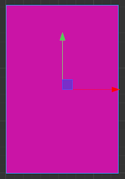

## Getting started by quickly reviewing
We need to repeat several steps from chapter 3 in-order to get started building our main game scene. We will go step by step, but there won't be as much detail.  If you get stuck, please refer back to chapter 3 for help. Let's get started!

* First, create a new `Scene` called __GameScene__ in the __Asset__ panel.

* Second, set the __design resolution__ of the __Canvas__ to __ 640 x 960__.

* Third, check both the __Fit Height__ and __Fit Width__ checkboxes.

* Last, create a __colored background__ from a __Sprite Node (Splash)__ to act as a `Layer` and help bring some definition to the game scene. Give the node the name __UI__ and a __size__ of __640 x 960__ and a __position__ of __0 x 0__. You can use whatever color you wish. Example:

    

Now, let's move on to creating the rest of the user interface.

__Task:__ Now is a good time to save your project! From the __File__ menu, select __Save Scene__ or use your operating system's shortcut key.

Next, let us continue [creating more UI](creating_the_rest_of_the_ui.md) elements...