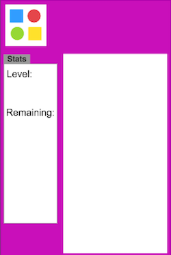
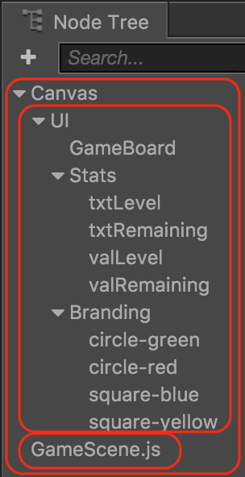

## Starting to code!
Now that we have our user interface laid out, we can start coding. Right from the start, there are some initial coding tasks to handle.

### How to start playing the game
Remember our __Main Scene__?

  

We need to make the __Play__ button work! How do we do that? Remember that we have all the code logic for __Main Scene__ scene in __MainScene.js__. To make the __Play__ button work we just need a single line of code added to our __callback__ function, modified to be:

```js
callback: function (event) {
    	cc.director.loadScene('GameScene');   
}
```

Notice that we added a line of code: `cc.director.loadScene('GameScene');`. This line simple says to load our __GameScene__.  Running this change in a browser shows what happens.

 __is replaced with__  

### Starting with core game logic
When the __Game Scene__ loads we need to have many things happen to make our game playable. We need to load a game board, load a sequence of peices that the player will use to solve the puzzle, start some music and more. To get started create __GameScene.js__ in the __Assets Panel__ and drag it directly into the __Node Tree__. Example:

  

Doing this will allow __GameScene.js__ to load and run on __Game Scene__ startup. This is exactly what we need to get our game to take shape and start being playable.

__Task:__ Now is a good time to save your project! From the __File__ menu, select __Save Scene__ or use your operating system's shortcut key.

[Adding more game logic](../05-writing-game-logic/index.md) could be fun, let's do it!